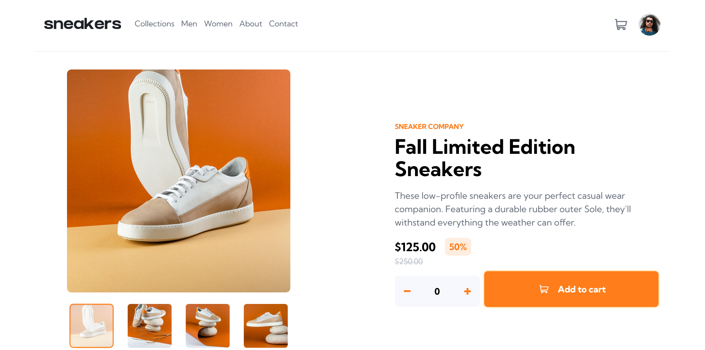

# Frontend Mentor - E-commerce product page solution

This is a solution to the [E-commerce product page challenge on Frontend Mentor](https://www.frontendmentor.io/challenges/ecommerce-product-page-UPsZ9MJp6). Frontend Mentor challenges help you improve your coding skills by building realistic projects.

## Table of contents

- [Overview](#overview)
  - [The challenge](#the-challenge)
  - [Screenshot](#screenshot)
  - [Links](#links)
- [My process](#my-process)
  - [Built with](#built-with)
  - [What I learned](#what-i-learned)
  - [Continued development](#continued-development)
  - [Useful resources](#useful-resources)
- [Author](#author)
- [Acknowledgments](#acknowledgments)

## Overview

### The challenge

Users should be able to:

- View the optimal layout for the site depending on their device's screen size
- See hover states for all interactive elements on the page
- Open a lightbox gallery by clicking on the large product image
- Switch the large product image by clicking on the small thumbnail images
- Add items to the cart
- View the cart and remove items from it

### Screenshot

### Links

- Solution URL: [https://github.com/mmustaphak/ecommerce-product-page-main](https://github.com/mmustaphak/ecommerce-product-page-main)
- Live Site URL: [https://ecommerce-product-page-main-beige.vercel.app/](https://ecommerce-product-page-main-beige.vercel.app/)

## My process

### Built with

- Semantic HTML5 markup
- Flexbox
- CSS Grid
- Mobile-first workflow
- [React](https://reactjs.org/) - JS library
- [Tailwind CSS](https://tailwindcss.com/) - CSS Framework

### What I learned
- I learnt how to implement the stripe library into the project.
- I also implement some basic animation for the first time.
- I also learnt how to handle events in React

### Continued development

This Project has shown me a lot of areas I get to improve on. I'm looking forward to learning more about transitions and animations in css as well as routing in reactJS using the react router library. I'm also looking forward to testing out other tools such as bootstrap and SCSS in the future.

### Useful resources

- [Triggering only parents onclick event](https://bobbyhadz.com/blog/react-onclick-only-parent) - This helped me for XYZ reason. I really liked this pattern and will use it going forward.
- [Event bubbling and capturing in React](https://blog.logrocket.com/event-bubbling-capturing-react/) - This is an amazing article which helped me finally understand how javascript handles event propagation. I'd recommend it to anyone still learning this concept.

## Author

- Frontend Mentor - [@mmustaphak](https://www.frontendmentor.io/profile/mmustaphak)
- Twitter - [@mmustaphak1](https://www.twitter.com/mmustaphak1)

## Acknowledgement
I would like to thank my good friend and mentor [@essinnation](https://x.com/esinnation) for pushing me in the right direction and giving me the suggestion to add a stripe payment gateway to the project